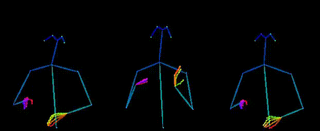
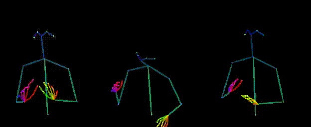
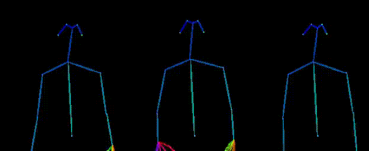
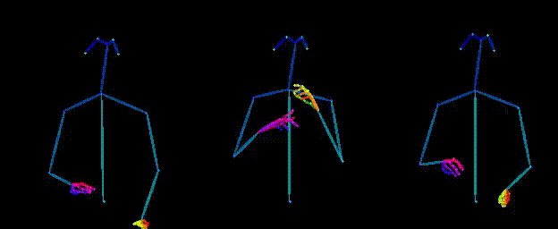
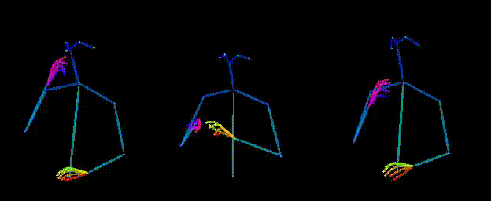
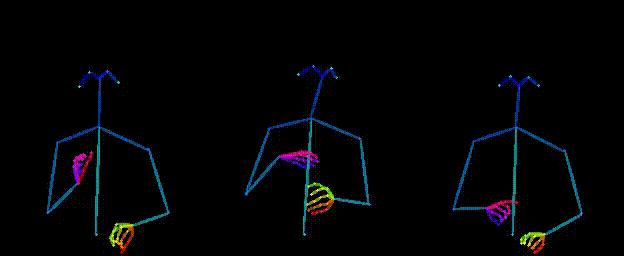
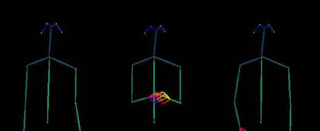
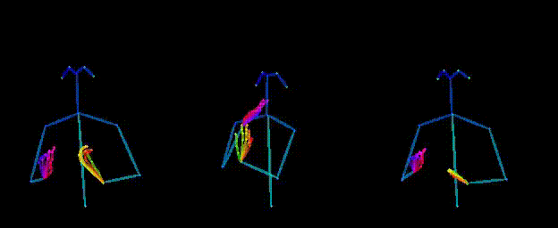
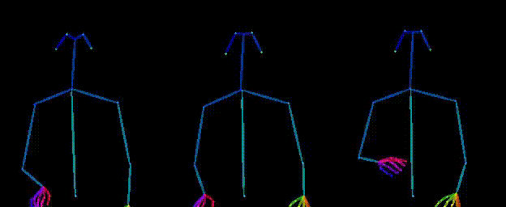
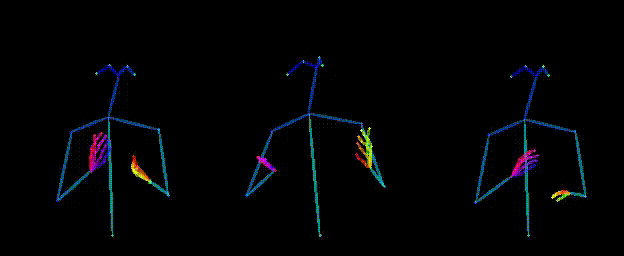

## Welcome to NaturalSigner Homepage
Generating natural and expressive sign language pose sequences from text has important practical significance.
However, current sign language generation (SLG) methods suffer from low quality and limited expressiveness.
In this work, we propose NaturalSigner, a classifier-free diffusion-based generative model designed specifically for SLG.
Specifically, it consists of a mixed semantic encoder that enhances the semantic consistency and expressiveness of the generated sign language, which takes both text and gloss as input; and a novel sign language denoiser that generates natural sign language pose sequences according to the output of the semantic encoder.
In addition, to achieve more natural and high-quality SLG, we design a sign language prompting mechanism to facilitate in-context learning in the diffusion model and duration predictor.
Experiments on two datasets show that NaturalSigner significantly outperforms the state-of-the-art methods in terms of semantic consistency, naturalness, and expressiveness.
On the Phoenix-2014T dataset, compared with the previous best end-to-end SLG method, NaturalSigner improves the BLEU-4 score of the back translation metric by more than 40% and reduces the Frechet Inception Distance (FID) by more than 12 times.

Demos
---------------
**We randomly selected 10 examples from the test set for demo display. From left to right in the video, the ground truth, NaturalSigner generation results and Progressive Transformer generation results are shown respectively.**

TEXT: am tag sechzehn grad an der ostsee und bis zu siebenundzwanzig grad am oberrhein . GLOSS: TAG OST SECHSZEHN MAXIMAL SIEBEN ZWANZIG GRAD FLUSS.

TEXT: am mittwoch eine mischung aus sonne wolken und nebelfeldern im nordwesten hier und da schauer sonst ist es trocken . GLOSS: MITTWOCH MISCHUNG WOLKE NEBEL NORDWEST BISSCHEN SCHAUER REGION TROCKEN.

TEXT: und nun die wettervorhersage für morgen freitag den achten oktober . GLOSS: JETZT WETTER WIE-AUSSEHEN MORGEN FREITAG ACHTE OKTOBER.

TEXT: das ruhige trockene und zum teil recht freundliche hochdruckwetter begleitet uns auch in den nächsten tagen . GLOSS: RUHIG TROCKEN FREUNDLICH NAECHSTE BLEIBEN.

TEXT: es wird morgen ein ziemlich trüber tag bei uns in deutschland . GLOSS: MORGEN TAG TRUEB.

TEXT: dazu im westen allerdings etwas milder mit minus vier bis minus sieben grad . GLOSS: WEST MEHR MILD MINUS VIER BIS MINUS SIEBEN.

TEXT: heute nacht gibt es im süden anfangs noch vereinzelte schauer oder gewitter sonst ist es meist klar oder nur locker bewölkt . GLOSS: HEUTE ABEND SUED REGION NOCH REGEN GEWITTER REGION KLAR HIMMEL BISSCHEN WOLKE.

TEXT: ab und zu kann sich die sonne zeigen . GLOSS: AUCH SONNE MOEGLICH.

TEXT: am freitag ist es in der nähe der küsten und ganz im süden teilweise stark bewölkt . GLOSS: FREITAG NAH KUESTE SUED WAHRSCHEINLICH STARK WOLKE.

TEXT: sommerliche temperaturen sind dabei eher die ausnahme . GLOSS: SOMMER TEMPERATUR SELTEN.

